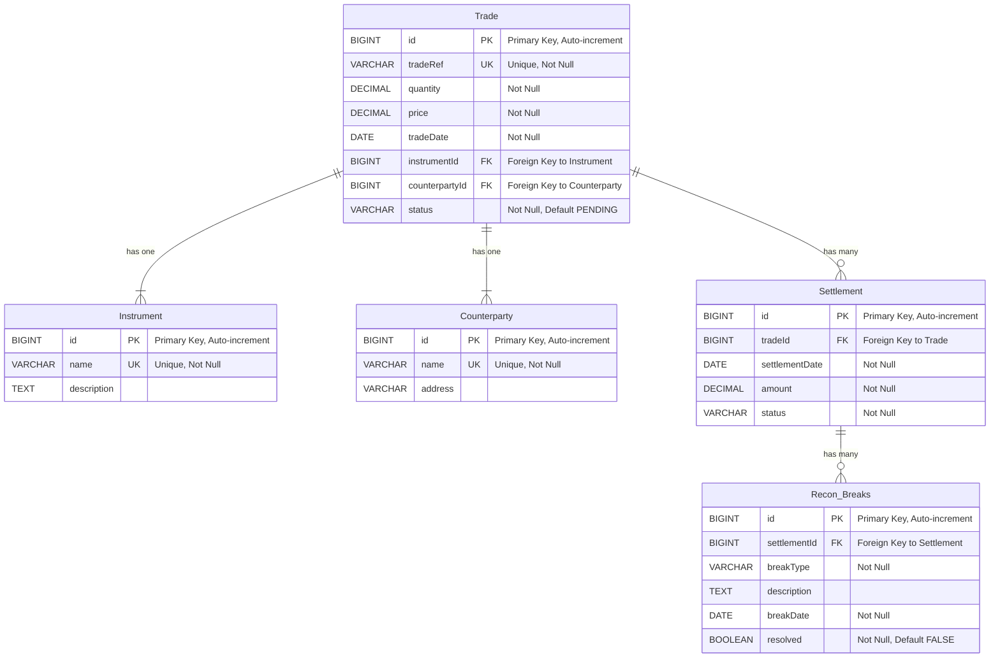

```mermaid
erDiagram
    Trade {
        BIGINT id PK "Primary Key, Auto-increment"
        VARCHAR tradeRef UK "Unique, Not Null"
        DECIMAL quantity "Not Null"
        DECIMAL price "Not Null"
        DATE tradeDate "Not Null"
        BIGINT instrumentId FK "Foreign Key to Instrument"
        BIGINT counterpartyId FK "Foreign Key to Counterparty"
        VARCHAR status "Not Null, Default PENDING"
    }

    Instrument {
        BIGINT id PK "Primary Key, Auto-increment"
        VARCHAR name UK "Unique, Not Null"
        TEXT description
    }

    Counterparty {
        BIGINT id PK "Primary Key, Auto-increment"
        VARCHAR name UK "Unique, Not Null"
        VARCHAR address
    }

    Settlement {
        BIGINT id PK "Primary Key, Auto-increment"
        BIGINT tradeId FK "Foreign Key to Trade"
        DATE settlementDate "Not Null"
        DECIMAL amount "Not Null"
        VARCHAR status "Not Null"
    }

    Recon_Breaks {
        BIGINT id PK "Primary Key, Auto-increment"
        BIGINT settlementId FK "Foreign Key to Settlement"
        VARCHAR breakType "Not Null"
        TEXT description
        DATE breakDate "Not Null"
        BOOLEAN resolved "Not Null, Default FALSE"
    }

    Trade ||--|{ Instrument : "has one"
    Trade ||--|{ Counterparty : "has one"
    Trade ||--o{ Settlement : "has many"
    Settlement ||--o{ Recon_Breaks : "has many"
```