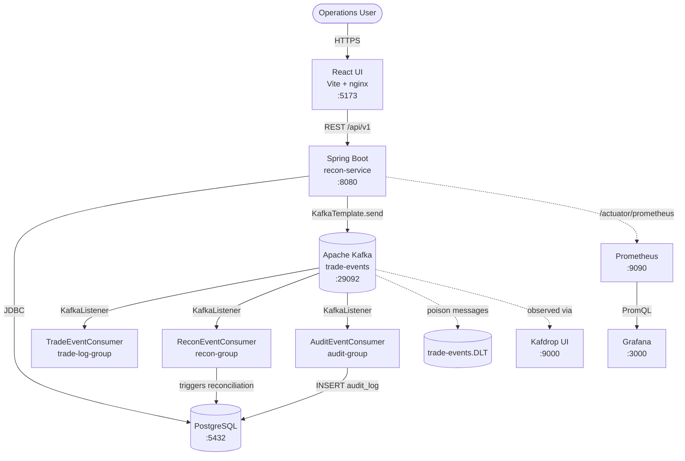
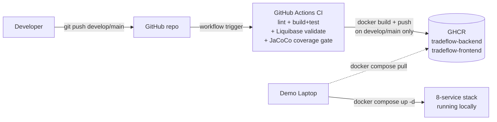

# TradeFlow — Architecture

## Component view

**Design decisions.**

- Kafka sits between the API and the consumers so a slow `audit_log` insert
  never blocks the user-facing `POST /api/v1/trades` — `TradeEventProducer`
  publishes and returns immediately, logging (not throwing) on failure so a
  Kafka outage never turns a successful DB write into a 500.
- **Three separate consumer groups** (`trade-log-group`, `recon-group`,
  `audit-group`) all read the same `trade-events` topic independently — one
  consumer group would only let one of the three actually see each event.
  `ReconEventConsumer` and `AuditEventConsumer` can fail or lag
  independently without affecting each other.
- A `DefaultErrorHandler` with a `DeadLetterPublishingRecoverer` routes
  unprocessable records to `trade-events.DLT` after 3 retries — deserialization
  failures skip the retry loop entirely since they can never succeed.
  Verified live against a real broker: a malformed message correctly
  DLTs for all three consumer groups; a "valid JSON, wrong shape" message
  only DLTs on the one consumer that actually dereferences the missing
  field (`AuditEventConsumer`), the other two just no-op.
- Prometheus **pulls** from the backend (not push) so a backend restart never
  loses metric history, and Grafana's Prometheus datasource + both
  dashboards (API, Kafka) are provisioned as files under
  `monitoring/grafana/provisioning/` — checked into git, not clicked
  together by hand in the UI.
- `ReconEventConsumer.runForTrade()` currently logs that reconciliation was
  triggered rather than writing a `ReconResult` — real per-trade
  reconciliation needs an external counterparty feed that isn't wired up
  in this project yet (same gap as `ReconciliationService.runForAll()`).
  This is deliberate: it's flagged rather than faked, and the recon flow
  is otherwise fully wired end-to-end for whenever that feed exists.

## CI/CD + deploy flow

**Design decisions.**

- GHCR (not Docker Hub) because the workflow's default `GITHUB_TOKEN`
  already has push rights with a single `permissions: packages: write`
  opt-in — no Docker Hub PAT needed in secrets.
- The `docker-build` job only runs on pushes to `develop`/`main` (not on
  every feature-branch push) and tags each image with both the commit SHA
  and `latest`, so the demo laptop can pin to a known-good SHA via
  `BACKEND_IMAGE`/`FRONTEND_IMAGE` in `.env` instead of trusting whatever
  `:latest` happens to point at mid-demo.
- `backend-build-test` runs `liquibase:validate` against a real Postgres
  service container and enforces a JaCoCo line-coverage floor (70%) on
  `com.dbtraining.tradeflow.service.*` — both fail the build fast, before
  the slower integration-test phase.
- Until CI has actually pushed images, `docker-compose.yml`'s
  `image: ${BACKEND_IMAGE:-ghcr.io/.../tradeflow-backend:latest}` pattern
  lets `BACKEND_IMAGE`/`FRONTEND_IMAGE` be overridden in a local `.env` to
  point at images built with `docker build` directly — see
  `.env.example`.
